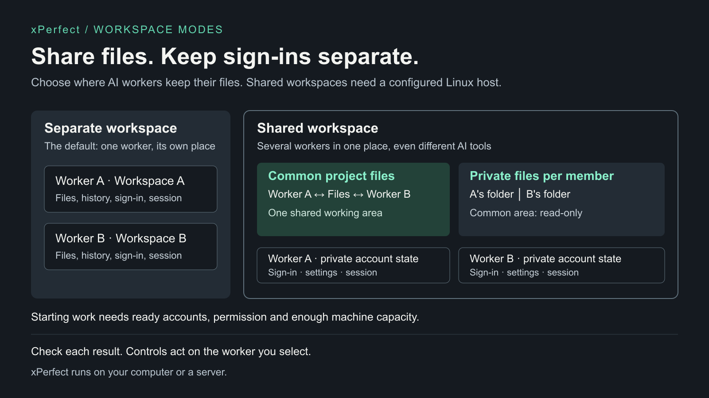

# xPerfect

Give an AI a goal and files. Watch its work, open the result, and return to it later.

xPerfect runs the AI tools you already use, such as Codex, Claude Code and Grok, and keeps each
task's files, progress and results together. It works on its own, on your computer or your server.

**Choose how to start**
- **On your computer:** `./xperfect start` gives one person a private web app. See below and the
  [quickstart](docs/quickstart.md).
- **On a server for several people:** people sign in with your identity provider, and each gets a
  5 GB file quota. See [hosted setup](docs/deployment-hosted.md) and its current limits.
- **From another AI app or your own code:** connect over MCP or the API. See the
  [developer walkthrough](docs/developer.md).

## Start locally

Requires macOS or Linux, Python 3.11 or newer, [uv](https://docs.astral.sh/uv/getting-started/installation/),
and the command-line tool of one AI provider you use: [Codex](https://developers.openai.com/codex/cli/),
[Claude Code](https://code.claude.com/docs/en/setup) or [Grok](https://github.com/xai-org/grok-build).
From the repository:

```sh
./xperfect start
```

The first start asks you to choose an unlock password (press Enter to have one made; save it in your password manager).

1. Open the printed URL, normally **http://127.0.0.1:8780**, unlock once, and connect your AI account in **Connections**. That browser stays unlocked for 30 days.
2. In **Run project**, enter a small goal, add any needed files with **Add files**, and select **Run Project**.
3. Watch the work, then open or download the result from **Files**. Reload: it is still there.

Try: “Write a short note explaining rain and save it as a text file.”


```sh
./xperfect doctor
./xperfect stop
./xperfect restart
```

A running app is not yet a connected AI: `doctor` shows which AI tools it found, and Connections
shows whether your account is ready. This local app is for one person; the AI works with your
user account's permissions. It is not a public multi-user deployment.

[Quickstart](docs/quickstart.md) · [Account and state setup](docs/host-setup.md) ·
[Deployment and recovery](docs/deployment.md)

## Work together or separately

By default each AI worker gets a separate workspace. A shared workspace lets several workers, even
different AI tools, work in one place with **Common project files** or **Private files per member**.
Shared workspaces need xPerfect on a configured Linux host, such as the packaged install; with
`./xperfect start` on a Mac, use a separate workspace.
Sign-ins and sessions always stay separate.



[Editable SVG](docs/assets/workspaces.svg)

Ten goals do not mean ten workers at once. xPerfect keeps every goal; ready accounts, machine
resources and configured limits decide what starts now, and other work waits or reports what
blocks it. Sharing files does not automatically share chat history, tools or permissions. See
[working on several goals](docs/capability-matrix.md#working-on-several-goals).

To let workers in your account find or message one another, open **Work together** on a
workspace card. Discovery and messages are separate choices; you approve the exact current
workers and can revoke either message direction later. On hosted servers without a secure
worker connection, the controls explain why native worker-to-worker tools are unavailable.

Work is stored on the host you run. Connected AI providers can receive task content and tool
results needed for their requests; local storage does not mean local-only AI processing.

## Current limits

- **Hosted servers:** sign-in, per-person storage and upgrades are tested. Connecting an AI
  account and getting a result on a hosted server have not been verified end to end yet.
- **Drag and drop:** drop areas exist, but dragging files in or out in a real browser has not been
  verified yet. Use **Add files** and **Download**.
- **API keys:** the key option exists, but API-key setup has not been verified end to end yet. Use
  a subscription sign-in.
- **Duplicate:** copies a workspace's files. Continuing the copy with a personal account needs an
  account confirmation that has not been verified end to end yet.

## Use and extend

- **Files:** keep original input bytes, inspect outputs, and download results. A filename alone is not an uploaded file.
- **Controls:** Watch, steer, interrupt or continue the exact worker. Read its recorded state before retrying.
- **AI providers:** Codex CLI, Claude Code and Grok Build use their own supported routes. Grok needs one exact model: `grok models`, then `./xperfect restart --model grok-build=<model>`.
- **MCP:** connect over stdio or authenticated streamable HTTP; compatibility SSE remains available.
- **API:** projects, workers, runs, schedules, events, files and lifecycle controls use the existing typed runtime.
- **Build on it:** the [developer walkthrough](docs/developer.md) shows how to connect, discover tools, start, check and steer work, and add a harness.
- **Extensions:** add authorized tools, skills and context. See the [technical setup](docs/03_Bootstrap_Auth_and_Identity_Projection.md).

Missing authentication, an unsupported route and exhausted capacity are different states. Use the
reported next action; do not substitute an account or call incomplete work finished. Provider routes,
desktop tools and shared execution are configuration-dependent.

## Documentation

- [Quickstart](docs/quickstart.md): first task, opened result and coming back to it
- [Deployment](docs/deployment.md): local versus hosted setup, state and upgrades
- [Capability guide](docs/capability-matrix.md): execution, accounts, files and storage boundaries
- [Workshop](docs/workshop.md): build and inspect a result from synthetic input
- [Developer walkthrough](docs/developer.md): MCP, API and worker harnesses
- [Contributing](CONTRIBUTING.md) · [Security](SECURITY.md)

Technical contracts:

1. [Vision and terminology](docs/01_Vision_Requirements_and_Terminology.md)
2. [Architecture and components](docs/02_Architecture_and_Components.md)
3. [Bootstrap, auth and identity](docs/03_Bootstrap_Auth_and_Identity_Projection.md)
4. [MCP publication and clients](docs/04_MCP_Publication_and_Client_Compatibility.md)
5. [QA playbook](docs/05_QA_Quick_Power_Playbook.md)
6. [References](docs/06_References.md)
7. [Operator UI](docs/07_Minimal_Unified_Operator_UI.md)
8. [Repository and publication boundaries](docs/08_Repository_Structure_and_Publication_Boundaries.md)
See [CHANGELOG](CHANGELOG.md) and the [runtime](runtime_phase1/README.md). Existing Python package names, `WPR_`/`GLASSHIVE_` configuration
and MCP/skill IDs remain compatibility interfaces; the product name is xPerfect.

## Creator

xPerfect is created by [Adrien Beyk](https://www.linkedin.com/in/adrienbeyk/).

[Instagram](https://www.instagram.com/adrienbeyk/)

## License

xPerfect is licensed under the [Apache License 2.0](LICENSE).
Third-party components retain their own licenses and notices. See [NOTICE](NOTICE).
