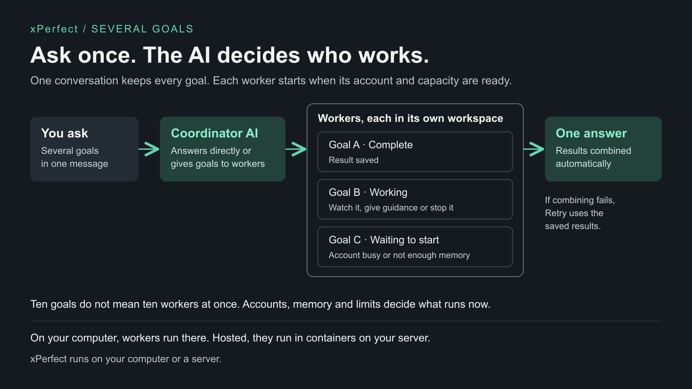

# xPerfect capabilities and boundaries

Choose a configured route, then check its readiness. A running service, authenticated account
and completed useful result are different things.

## Working on several goals

[Editable SVG](assets/parallel-work.svg)

- **Ten goals can be tracked without ten workers running at once.** Machine resources, account limits and configured capacity control how much runs in parallel. Other work can wait in the queue or report what prevents it from starting.
- **Choose where files go.** Separate workspaces keep execution apart. A supported shared workspace can offer shared files or separate working folders. Shared files need coordination when workers edit the same content.
- **Sign-ins stay separate.** Each worker needs permission to use its selected account. Sharing a workspace does not share credentials or remove provider limits; a separate paid account for every goal is not implied.
- **Give each worker the context it needs.** Its goal, files, instructions and tools come from its authorized configuration and task. Shared files do not automatically share conversation history or grant access to another worker's tools. Cross-worker requests need explicit permission.
- **The AI decides the work; the runtime runs it.** When the coordinator is configured, its AI can work directly or delegate to authorized workers. xPerfect records goals, queues runs and applies controls. An external AI client can also direct work through MCP or the API.

The [architecture](02_Architecture_and_Components.md#coordinator-ownership) explains coordination.
The [workspace contract](02_Architecture_and_Components.md#workspace-file-placement) defines file placement.

## Capabilities

| Capability | Use | Boundary |
| --- | --- | --- |
| Projects, workers and runs | Keep goals, progress and recorded execution attempts together. | A project groups work; it does not imply one shared computer. |
| Native profiles | Use Codex CLI, Claude Code, OpenClaw or the Grok adapter. | Models, authentication, tools and controls depend on the selected route. An adapter is not universal provider compatibility. |
| Accounts | Connect through an offered subscription or API-key method. | Platform, deployment, account grants and provider capacity govern availability. No silent fallback to a different account. |
| Isolated workspaces | Keep worker execution and working files separate. | Local host execution still has the trusted OS user's permissions. |
| Workspace catalog | Name and favorite private workspaces for reuse. | Catalog visibility remains user-scoped. |
| Shared workspaces | Let authorized workers use one execution workspace. | The host must support it and have the required permissions and capacity. |
| Shared files | Workers use a shared working area. | This does not share sign-ins or sessions. |
| Separate working folders | Each worker has its own working area within a shared workspace. | Its access to the common file area is read-only. |
| Files | Attach input, inspect output and download original bytes. | A file reference must be authorized and attached; a name in a prompt is not an upload. |
| Duplicate workspace | Copy a workspace's files into a new workspace. | Copies every byte, with no default size cap. The owner's storage limit and a 30-second default copy time apply. A refused copy keeps none of its bytes and names its cause, such as storage or host capacity. Retry the same request after freeing storage or restoring the limit. |
| Watch and controls | Inspect, steer, interrupt or continue the selected worker. | Controls are provider-dependent and target one worker, not its siblings. |
| Desktop and terminal | View a workstation through noVNC or take over its terminal through the WebSocket bridge. | These surfaces require a configured workstation profile and authorized access. |
| Conversation and peers | Keep conversation context and request authorized worker collaboration. | Discovery and control need explicit scope; common ownership alone does not grant access. |
| Schedules | Run configured work later or repeatedly. | Each run still needs valid account, input and execution authority. |
| MCP and API | Integrate typed projects, workers, events, files and controls. | Stdio and authenticated HTTP are distinct paths. Compatibility SSE remains available. |
| Bootstrap and extensions | Supply authorized skills, context, tools and configuration. | Preserve the user's goal, constraints and configured model. |
| Identity projection | Use native host projection or an optional external broker for provider identity and connected tools. | Keep credential leases private. |
| Persistence | Retain project, worker, run, event and workspace state. | A saved record is not a guarantee that interrupted native work auto-resumes. |
| Local storage | Use private persistent state outside the checkout. | Unlimited by default; available disk space still applies. |
| Hosted storage | Each person has a storage limit, 5,000,000,000 bytes by default (`storage_limit_bytes` at install). The runtime lets a tenant administrator set, raise or restore any person's limit; a person can lower their own. | No default per-file or file-count cap; the XFS project limit enforces it. When the operator sets a `role_map` (off by default), a mapped administrator can raise or restore their own limit over MCP. A control for changing another person's limit, over MCP or in the web UI, is not available yet. |
| Standalone deployment | Run xPerfect on a host or server. | Hosted multi-user operation needs separate identity and isolation configuration. |
| Exact models | Choose the exact model a worker type uses (`--model grok-build=<model>`). | Grok needs one; xPerfect never guesses or swaps a model. Without a choice, local Codex uses its own configured model and Claude Code is asked for its `opus` alias; `./xperfect doctor` shows each. |
| Packaged upgrade | Move a packaged install to a new image, then commit or roll back. | Needs an idle package. Rollback returns service state to the upgrade and discards later records; owner files are not copied. |

Local storage is not local-only AI processing. Connected providers can receive task content and
tool results needed for their requests. Check the selected provider's terms and your access policy.

For named Claude subscription accounts on macOS, use the current-account native sign-in route
or an offered API-key route; named subscription isolation needs a supported host. Other routes
are shown by the running connection catalog.

[Quickstart](quickstart.md) · [Account setup](host-setup.md) · [Deployment](deployment.md) ·
[Architecture](02_Architecture_and_Components.md)
