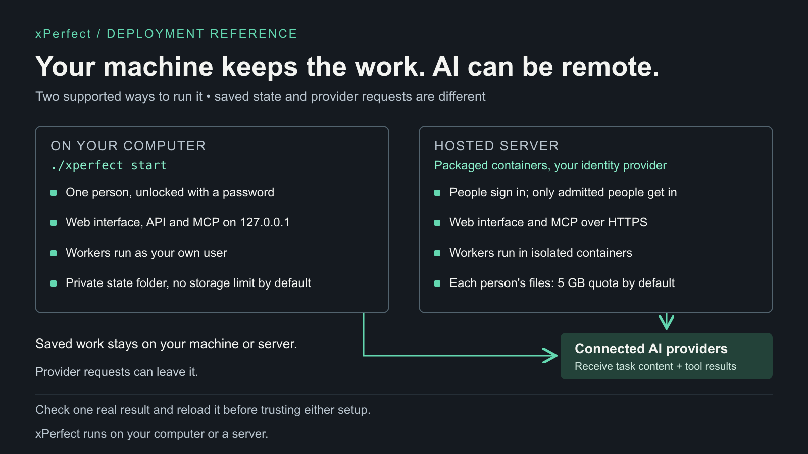

# Run xPerfect locally or on a Linux host

## Local development

Use macOS or Linux, Python 3.11 or later, and `uv`. From the checkout root:

```sh
./xperfect start
./xperfect doctor
```

Open the printed URL, normally `http://127.0.0.1:8780`. The launcher owns the API, UI and MCP,
their loopback bindings, distinct credentials and private state. It uses locked Python
environments. See [quickstart](quickstart.md) and [host setup](host-setup.md).

Host workers have the OS user's permissions. Do not expose this single-user setup as a
multi-user service. Connect the intended provider account, run a small task, and open its output.

Saved state and workspace files are stored on the selected host. The connected AI provider can
still receive task content and tool results needed for model requests. Running xPerfect locally
does not make remote inference offline, local-only, or independent of the provider's data policy.

### Packaged Linux

The standalone Linux package uses the explicit Docker endpoint and a private, owner-only
credentials file. It creates one fixed local owner and a generated password; the ordinary receipt
contains URLs and image identities only.

```sh
python3 deployment/linux/launch.py \
  --docker-host unix:///var/run/docker.sock \
  --name xperfect-local \
  --service-image sha256:<verified-service-image> \
  --native-image sha256:<verified-native-image> \
  --receipt /private/xperfect-local.receipt.json \
  --credentials /private/xperfect-local.credentials.json
```

To use Grok, add `--model grok-build=<model>` with an exact ID from `grok models`. The launcher
never picks a model; the choice is saved in the package and kept across restarts and upgrades.

Open the printed loopback UI URL. Select **Unlock xPerfect** and use `ui_password` from the
mode-0600 credentials file. The password is reusable across reloads and service restarts. It is
never printed in the receipt, URL, process arguments, service environment or access log. Keep the
credentials file private; it also contains the separate MCP client key. The package refuses to
start when the owner, local authentication namespace, verifier, or private state is missing,
ambiguous, disabled, or corrupt.

## Hosted deployment requirements

The diagram is a Linux reference topology, not an all-cloud installer or a managed service.
A hosted deployment needs the complete identity, isolation and persistent-state configuration;
opening the local UI port is not sufficient.



[Editable SVG](assets/deployment.svg)

| Component | Requirement |
| --- | --- |
| Durable state | Preserve databases, workspace files, provider state and link references. Back up encryption and signing configuration with its state. |
| Runtime | Private API listener, stable data paths and explicit execution mode. |
| Operator UI | TLS and authenticated access for remote users. |
| MCP | Keep service-token access private. Public client access needs its separate OAuth setup. |
| Workers | Supported Docker substrate, bounded compute, correct host-visible mounts and ready provider accounts. |
| Edge proxy | TLS, streaming/WebSocket support, and no raw credentials or signed links in logs. |

If the control plane manages sibling containers, mount paths must use the Docker host's paths.
Docker socket access gives the controlling service substantial authority over that host.

### Human identity

The gateway's configuration includes `GLASSHIVE_HUMAN_AUTH_MODE=oidc`,
`GLASSHIVE_SECURITY_MODE=multi_user`, `GLASSHIVE_OIDC_ISSUER`,
`GLASSHIVE_OIDC_CLIENT_ID`, `GLASSHIVE_OIDC_REDIRECT_URI`, and
`GLASSHIVE_OIDC_PRINCIPAL_CLAIM`. This is an inventory, not a runnable environment file.
Runtime and MCP secrets, tenant, state and admission settings must be configured together.
Multi-user issuer and redirect URLs must use HTTPS.

Browser and MCP must resolve the same immutable user identity. Enroll users through the
supported administration path. Check with two authorized test users: each must see only their
own work and files, including after reconnect. A service token does not authenticate a human.

### Storage and execution

The default hosted storage policy is 5,000,000,000 bytes per user, configurable, with no default
per-file, file-count or separate batch-byte limit. Local storage is unlimited by default.
Check the reported enforcement tier: admission accounting is not a filesystem hard quota.
Provider credentials and native sessions remain private when work files are shared.

## Check a deployment

1. Check service health and execution-substrate availability separately.
2. Connect the intended account through an offered provider route.
3. Run a task with synthetic input and request a small output file.
4. Open and download the output; compare it with the task and input.
5. Reload and confirm the same task and files remain accessible.
6. Exercise interrupt and supported continuation on disposable work.

For failed sign-in, inspect issuer, callback and principal mapping. For unavailable workers,
inspect account readiness, capacity and substrate. For missing output, read task status and
Files before retrying. Keep diagnostic logs private.

## Upgrade and restore

1. Record the source revision and configuration. Interrupt active work, then run `./xperfect stop`.
2. Take a consistent private backup of the full state directory and its associated configuration.
3. Update the source using the release's instructions.
4. Run `./xperfect start` with the same state directory, then `./xperfect doctor`.
5. Check account readiness, saved work, downloaded bytes and one new result.

The default state directory is `~/.local/state/xperfect`. Protect backups as credentials:
they include private account and application state. Do not run two checkouts against the same state.
Reverting code alone is not a database rollback. When needed, stop the services and restore the
matching source revision and consistent state/configuration backup together.

### Upgrade a packaged Linux install

Load the new image on the Docker host, then run one command with the package receipt. The same
command upgrades local and hosted packages:

```sh
python3 deployment/linux/launch.py upgrade \
  --docker-host unix:///var/run/docker.sock \
  --receipt /private/xperfect-local.receipt.json \
  --service-image sha256:<new-service-image>
```

The upgrade:

1. Checks the package is idle and stops it. Active or retained work refuses the upgrade with
   the reason, and nothing changes. Finish, stop or close that work, or wait for idle
   workspaces to be released. The running version checks its own state. If it cannot read
   state an earlier release wrote, the new version checks the state it will take over
   instead. Either way, the same check repeats once the package has stopped.
2. Copies the service state (sign-ins, projects, settings, links) to a private backup.
   Owner files are not copied or changed.
3. Starts the same services from the new image and checks that they answer.

If they do not answer, the previous version starts again with the state it had. Otherwise check
the new version, then keep it or go back:

```sh
python3 deployment/linux/launch.py upgrade-commit --docker-host unix:///var/run/docker.sock --receipt /private/xperfect-local.receipt.json
python3 deployment/linux/launch.py upgrade-rollback --docker-host unix:///var/run/docker.sock --receipt /private/xperfect-local.receipt.json
```

- **Rollback** returns the previous version with its service state as it was at the upgrade.
  Service records made while the new version ran are discarded: sign-ins, access changes,
  projects and runs. Review access changes made in that time; a rollback undoes them. Owner
  files written in that time stay on disk and count toward storage. The output lists which
  service state had changed.
- **Commit** removes the previous version and the backup. Until then the backup holds the same
  sign-ins and secrets as the service, so commit or roll back promptly.

Rollback first checks, and changes nothing unless all of these hold:

- The backup is present and matches its recorded copy.
- The new version has no active work. Terminate workers the new version started so their
  workspace containers are removed; a rollback would orphan them.
- No owner received storage after the upgrade. Rewinding that record would lock the owner out,
  so rollback refuses; commit instead.

If an upgrade or rollback stops part-way, run the same command again; it resumes from its record.
An interrupted commit can only be finished with `upgrade-commit`.

You can add `--native-image sha256:<image>` to change the worker image. New workspaces use it;
existing workspaces keep the image they were created with, so keep that image loaded. Add
`--model grok-build=<model>` to set or change a model. Hosted packages with a private test
certificate also need `--ca-file`. If the package was changed outside the launcher,
`--adopt-running-containers` accepts its running containers after the same checks. A receipt
from an earlier launcher that does not name the links volume is completed from the package
itself; the upgrade refuses unless every service uses that package's own links volume.

A package created by an earlier launcher may lack settings that newer images declare for every
package of its kind. One example is the account isolation that lets people connect subscription
accounts.
- The upgrade reads those settings from the new image, adds any that are missing, and lists what it
  added.
- It never changes a setting that is present. If any service already holds a different value, that
  setting is left as it is in every service and reported.
- An image that declares no settings adds none.

A hosted package also needs a private key of its own before stored files can be attached to a
workspace. If an earlier launcher did not create it, the upgrade creates one for the runtime
service only. It lists the key's name, never its value, and never replaces a key that is present.
Running the upgrade with the image the package already runs is enough to add it.
- Attach again any file that failed to attach before the key was added.
- `upgrade-rollback` removes the key together with the rest of that upgrade. Run the upgrade again
  to add it back.
- Newer images refuse to start a hosted runtime without the key, and name this upgrade as the fix.

A local package accepts workspace sharing and permission confirmations only from its signed-in
owner. The UI signs them with a private key kept in its own state. The runtime holds only the
matching public key, and MCP holds neither. New packages get this at launch. A local package from
an earlier launcher refuses those confirmations with "An authenticated human confirmation session
is required" until it is upgraded. The image it already runs is enough. The upgrade:
- creates the key inside the UI's state and gives the runtime only the public half;
- keeps an existing key across later upgrades and restarts, and never replaces it;
- refuses, without changing anything, a package whose keys are partial or held by the wrong service.
- `upgrade-rollback` removes the key together with the rest of that upgrade.

On a package from an earlier launcher, an attach that failed for want of that key can leave a
file registration that never finished. The upgrade then refuses with "Files projection must
settle". Run it again with `--recover-unpublished-files` and a new image that carries the recovery:
- The new image checks, from the live package, that the running version still cannot authorize any
  stored file, so it could not publish one. It also checks that no receipt, staged copy or workspace
  file exists for it.
- It then retires exactly the registrations it reviewed, all or none, and the usual idle checks run
  unchanged.
- The stored upload and the attachment record are kept. The retired identities are listed in the
  result and receipt. A private record beside the receipt keeps identities and content hashes only.
- Anything else refuses the upgrade with the reason, and nothing changes. That includes a version
  that has its key, or a copy or file that exists.
- A rollback after this does not bring the retired registrations back. The previous version still
  has no key, so a new attach there can leave another; run the same recovery again.

### Offline packaged Linux G8 restore

Use a private archive produced by `native_continuity.capture_state` from a quiescent source and a
service image built from the matching reviewed code. Keep the archive and the package receipt
owner-only. Stop the recorded runtime, UI, MCP, and any other container using either package
volume. The restore command checks their exact identities and volume labels before it starts a
networkless helper. Do not start package writers during the restore or its rollback/commit.

```sh
python3 deployment/linux/restore.py package-restore \
  --docker-host unix:///var/run/docker.sock \
  --receipt /private/xperfect-local.receipt.json \
  /private/g8-archive
```

The command prepares a disposable copy, installs both `data` and `control` volume state, binds
restored Files Trash to the installed inodes, and retains the old state in a private transaction
backup. It preserves the target package configuration. Provider credentials and sessions need
fresh authorization; they are not copied from the archive. For hosted XFS, provision and attest
each target owner root first. The restore rejects missing or mismatched owner/quota bindings.

For hosted XFS, capture with the package storage settings and `GLASSHIVE_OWNER_STORAGE_BYTES` set to
the receipt's `storage_limit_bytes`. Owners without their own limit use that value; capture and
restore refuse when it is missing or differs from the kernel limit. The restore command passes it
from the receipt. Until commit, the old owner files stay in the same owner quota as the restored
ones, so an owner needs free quota for its restored files. Restore an owner above half its limit
into an empty target owner root.

Start the package from its recorded container identities. Check account readiness, saved work,
Files bytes and Undo, then a new task. Stop all package writers again before deciding:

```sh
python3 deployment/linux/restore.py package-commit \
  --docker-host unix:///var/run/docker.sock \
  --receipt /private/xperfect-local.receipt.json
```

If the checks fail, run `package-rollback` with the same endpoint and receipt while the package
is stopped. An interrupted install leaves a private journal under the control volume; inspect
that transaction and roll it back before another restore. Keep the source archive until the
post-restore checks and commit finish.

`GLASSHIVE_*`, `WPR_*`, Python package names and existing MCP/skill IDs remain compatibility
interfaces. See [runtime documentation](../runtime_phase1/README.md) for detailed contracts.
