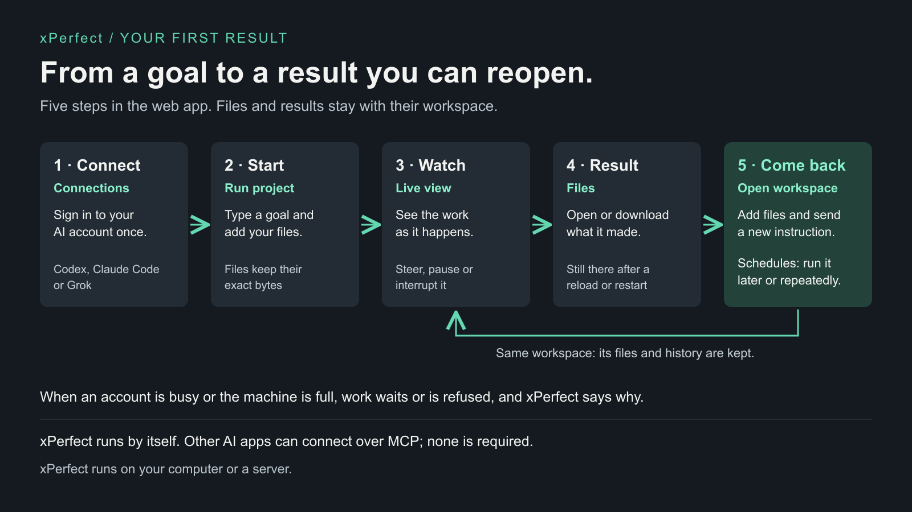

# xPerfect quickstart: your first result

This walkthrough takes you from a fresh checkout to a finished result that you can open again
later. It uses the private web app on your own computer.



## 1. What you need

- macOS or Linux, Python 3.11 or newer, and [uv](https://docs.astral.sh/uv/getting-started/installation/).
- Internet access. The first start installs dependencies, and the AI runs at your provider.
- The command-line tool of one AI provider you use, installed on this computer:
  [Codex](https://developers.openai.com/codex/cli/), [Claude Code](https://code.claude.com/docs/en/setup)
  or [Grok](https://github.com/xai-org/grok-build). [Account setup](host-setup.md) lists the tested versions.

## 2. Start xPerfect

From the repository:

```sh
./xperfect start
```

The first start asks you to choose an unlock password. Press Enter to have one made, and save it
in your password manager. Open the printed address, normally **http://127.0.0.1:8780**, enter the
password on **Unlock xPerfect** and select **Unlock**. This browser stays unlocked for 30 days.

`./xperfect doctor` prints a status report: whether the app is healthy, which AI tools it found,
and the exact model each one will use. Your saved work lives outside the checkout.

## 3. Connect your AI account

Open **Connections**. Under **Connect an AI account**, choose your **AI**, then:

- **Codex:** choose **My subscription** and **Connect Codex**, then **Open Codex sign-in** and
  enter the one-time code shown in xPerfect.
- **Claude Code:** if you are signed in to Claude Code on this computer, choose
  **Use existing Claude sign-in**.
- **Grok Build:** choose **My subscription** and **Connect Grok Build**, then
  **Open provider sign-in**. Grok also needs one exact model: run `grok models`, then
  `./xperfect restart --model grok-build=<model>`.

Wait until the account shows **Ready**. A running app is not yet a connected AI.

## 4. Start a project

Open **Run project**. Under **What would you like to do?**:

1. Describe the goal. Add **Success criteria** or **Background** if they help.
2. Choose the **Worker** for your AI tool and its **Account**. Keep **Separate workspace (default)**.
3. Select **Add files** to attach files. The worker gets their exact bytes; a file name typed in
   the goal is not an upload.
4. Select **Run Project**.

Try: “Write a short note explaining rain and save it as a text file.”

The workspace's live view opens. If the page stays on “Starting project...”, open the workspace
from **Workspaces**.

## 5. Watch and steer

The live view shows the work as it happens. Type guidance in **Steer this workspace** and select
**Send**. Use **Pause**, or **Interrupt current run** in the **☰** menu. Controls act only on this
workspace.

Some AI tools, such as Grok, ask before running a command. Answer in the live view: a request
left unanswered expires after about a minute and stops the run. Send a follow-up to continue.

## 6. Open the result

When the work is done, open **Latest workspace output** or **Files**, then **Open** or
**Download** what it made. Reload the page: the result is still there. It also survives
`./xperfect restart`.

## 7. Come back to it

In **Workspaces**, choose **Open workspace**. In **Files**, **Add files**, then send a new
instruction. The workspace keeps its files and history.

To run it later or repeatedly, open **Schedules** and select **New schedule**. Choose the
workspace, write what it should do, choose when it repeats and select **Create schedule**.
Scheduling a one-off run keeps it as a saved workspace.

## Good to know

- **Several goals at once.** In **Conversation**, write them in one message. xPerfect keeps every
  goal and shows each as Working, Waiting to start or Complete. The AI decides whether to answer a
  goal itself or hand it to a worker. Ten goals do not mean ten workers at once: a worker starts
  when its account is free and the machine has room. See [several goals](capability-matrix.md#working-on-several-goals).
- **Separate or shared.** By default each worker has its own workspace. A shared workspace lets
  several workers, even different AI tools, work together with **Common project files** or
  **Private files per member**. It needs xPerfect on a configured Linux host, such as the packaged
  install; with `./xperfect start` on a Mac, use a separate workspace. See [workspace modes](assets/workspaces.png).
- **Your computer or a server.** With `./xperfect start`, workers run on this computer as your
  user. On a hosted server, each workspace runs in its own container. Your files stay on your
  machine or server; your AI provider receives the task content it needs. See [deployment](deployment.md).
- **What a worker knows.** Its goal, the background and files you give it, its own built-in tools,
  and only the connections you allow. Change this in **Workspaces → More → Workspace settings**.
  See [context and tools](capability-matrix.md#what-each-worker-knows-and-can-use).
- **No other app needed.** xPerfect works on its own. Other AI apps can use it over MCP; see the
  [developer walkthrough](developer.md).

## If something goes wrong

| What you see | What to do |
| --- | --- |
| `doctor` reports a problem | Read the named private log, fix it, and start again. |
| “Connect an AI account to start.” | Connect an account in Connections and wait for **Ready**. |
| A run stopped with your provider's words, such as a usage limit | Follow them. Connections shows the message under that account until a later run completes. xPerfect never switches accounts for you. |
| “Queued” or “Waiting to start” | The account is busy or the machine is short of room. It starts on its own when that clears. |
| A host resource message after **Run Project** | The machine is busy. Check **Workspaces** so you do not start the same work twice, wait a moment, then try again. |
| “Not enough storage for this file” | Delete files you no longer need, or ask your administrator to raise your limit, then **Retry**. |
| “Shared workspaces need xPerfect on a configured Linux host.” | Choose **Separate workspace** on this computer. |
| The result is missing | Check the workspace's status and **Files** before running it again. |

Use the same `--state-dir` for every command if you chose one. `./xperfect stop` keeps your
files, accounts and history. Interrupt running work before a planned stop; interrupted work does
not always continue by itself.

## Current limits

- Dragging files into or out of the browser has not been verified yet. Use **Add files** and **Download**.
- API-key sign-in has not been verified end to end yet. Use your subscription sign-in.
- **Duplicate** copies a workspace's files. Before the copy can run, its account must be approved
  for it; continuing a copy this way has not been verified end to end yet.
- Several goals in one conversation and shared workspaces were verified on the packaged Linux
  install, not with `./xperfect start`.

## Connect an MCP client

For local stdio, use the absolute path to `xperfect` as the command and `["mcp"]` as arguments.
Start xPerfect first. HTTP MCP is `http://127.0.0.1:8767/mcp` with its own private token. Never put
tokens in URLs, screenshots or Git. See the [developer walkthrough](developer.md).

More: [account setup](host-setup.md) · [capabilities](capability-matrix.md) ·
[deployment and recovery](deployment.md)
